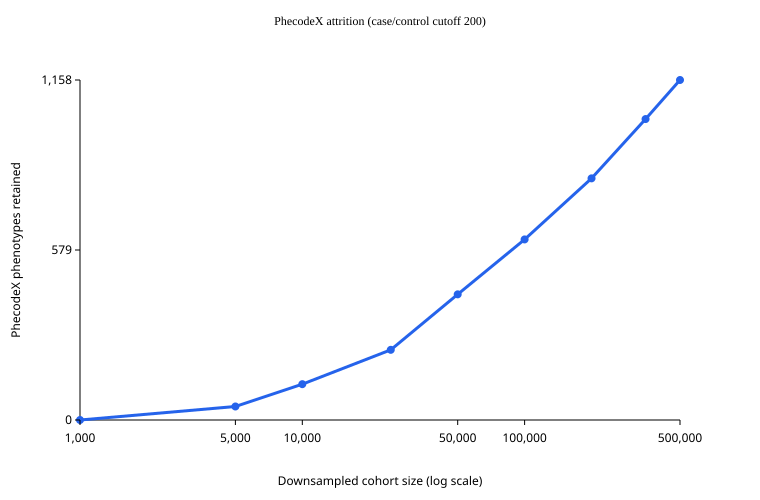

# PhecodeX consortium mapper

Applies a versioned PhecodeX mapping release to cohort ICD events and produces a
binary phenotype matrix plus aggregate QC outputs. Mapping runs locally at each
biobank; participant-level data never needs to leave the secure environment.

**If you are an analyst who has been pointed at a release**, you need five sections:
[Get the bundle](#get-the-bundle), [Install](#install),
[Standard workflow](#standard-workflow),
[Input contract](#input-contract) and [Outputs](#outputs) — then
[Quality control](#quality-control) once you have a run. If something goes wrong,
[When a run refuses to start](#when-a-run-refuses-to-start) and
[When a run succeeds but the numbers look wrong](#when-a-run-succeeds-but-the-numbers-look-wrong)
cover what you are likely to hit.
[How many phenotypes will I get?](#how-many-phenotypes-will-i-get) is worth reading
before you plan the analysis. [ANALYST_GUIDE.md](ANALYST_GUIDE.md)
covers UK Biobank extraction, containers, and the two checks worth running once.
Everything below "What the map contains" is background you do not need to start.

**If you are building or distributing a release**, go to
[For maintainers](#for-maintainers).

Two things catch people out:

| | |
|---|---|
| **State which ICD-10 you have.** `ICD10` (WHO) and `ICD10CM` are different vocabularies. UK Biobank is `ICD10`. The wrong label does not fail — it quietly drops or misassigns events. | [detail](#you-must-state-which-icd-10-you-are-mapping) |
| **Never leave a cell blank in an exclusions file.** A blank would void the whole rule, so a run refuses the file instead of accepting it. | [detail](#exclusion-files-must-not-have-blank-cells) |

## Get the bundle

A release is distributed as an analyst bundle — one `.tar.gz` published as a
[GitHub Release](https://github.com/astheeggeggs/phecode_mapping/releases),
alongside a `.sha256` sidecar. Download both, then:

```bash
shasum -a 256 -c phecodex-cm1.1-who1.0-icd-only.tar.gz.sha256
tar xzf phecodex-cm1.1-who1.0-icd-only.tar.gz
cd phecodex-distribution
```

The archive extracts to a single directory, `phecodex-distribution`. **Every command
in this README is run from inside it**, which is why a bare `--release release`
resolves: the release is a subdirectory of the bundle, not the download itself. So
is the mapper — `pip install .` below installs the code that shipped with this
release, not a separately obtained copy.

Check the `.sha256` even though step 1 of the workflow verifies the release too.
The two checks answer different questions: `verify_release.py` re-hashes the release
against its own `manifest.json`, so it cannot tell you the download arrived intact
or that it was the bundle you were meant to have.

## Install

Python 3.11 or newer is required. For a pinned installation:

```bash
python -m venv .venv
.venv/bin/pip install -r requirements-lock.txt
.venv/bin/pip install .
```

You can also use the supplied Docker or Apptainer/Singularity definitions;
see [ANALYST_GUIDE.md](ANALYST_GUIDE.md).

## Standard workflow

Three commands, run from the extracted bundle (see [Get the bundle](#get-the-bundle)).
`release` is the release directory inside it.

```bash
# 1. Confirm the release is intact and is the one that was built for you.
.venv/bin/python scripts/verify_release.py --release release

# 2. Validate your inputs without mapping anything.
.venv/bin/phecodex-map run --release release \
  --cohort cohort.csv --events events.csv --output phecodex_run --preflight-only

# 3. Map.
.venv/bin/phecodex-map run --release release \
  --cohort cohort.csv --events events.csv --output phecodex_run
```

Step 1 is not a formality: it re-hashes every shipped file against the digests
recorded at build time, and refuses a release carrying an unrecorded file the mapper
would read. Step 2 catches the input problems that otherwise complete "successfully"
with nothing mapped.

`run` refuses to overwrite an existing output directory. On a 500,000-person cohort it
takes a few minutes and wants about 16 GB of memory — see
[ANALYST_GUIDE.md](ANALYST_GUIDE.md) for measured figures. If a command stops with an
error, [When a run refuses to start](#when-a-run-refuses-to-start) lists what each
refusal means.

**Phenotype exclusions are applied by default.** `run` drops the bundled recommended
set — `Symptoms`, `Neonatal`, `Infections`, and three administrative
pregnancy-encounter phecodes — so you get that policy whether or not you ask for it.
To use a reviewed alternative, pass `--exclude-phenotypes <file>`; to see exactly
what the default does, the file is
[`src/phecodex_mapper/data/recommended_exclusions.csv`](src/phecodex_mapper/data/recommended_exclusions.csv).

## Input contract

The cohort must contain one row per person:

```text
person_id,sex
```

`person_id` must be non-null and unique. `sex` must be `Male`, `Female`, or
blank. Additional columns are ignored.

The events file must contain one row per event:

```text
person_id,code,vocabulary,event_date
```

`event_date` is optional for the default `any-event` rule. It is required, and every
date must be ISO `YYYY-MM-DD`, for `--case-rule two-dates` — see
[Case rules](#case-rules).

Supported vocabularies are `ICD9CM`, `ICD10`, `ICD10CM`, and `SNOMED`. Codes are
normalized before matching. Events for people absent from the cohort are counted and
reported — see `events_for_unknown_people` in `audit.json`, and preflight will tell you
before you run.

For UK Biobank's wide phenotype export, use
[`scripts/prepare_ukb_for_mapping.R`](scripts/prepare_ukb_for_mapping.R) in
the secure environment. It requires explicit female and male encodings and
writes compressed cohort and event files. Do not commit its outputs.

### You must state which ICD-10 you are mapping

`ICD10` (WHO) and `ICD10CM` (US clinical modification) are different vocabularies,
and the `vocabulary` column is taken as ground truth: a code declared `ICD10CM` is
matched only against the release's ICD-10-CM rows, never against WHO. Declaring the
wrong one does not fail — the codes simply do not match, and the events are dropped
into `unmapped_events.csv`.

This matters more than it sounds, because the two maps differ in both directions:

| | distinct codes in the shipped map |
|---|---|
| `ICD10` (WHO) | 8,560 |
| `ICD10CM` | 55,338 |
| in both | 7,730 — of which **163 carry different phecodes** |

So there is no safe default. Declaring WHO events as `ICD10CM` loses every WHO-only
code; declaring CM events as `ICD10` loses CM's finer subdivisions. And for the 163
codes present in both, the wrong label yields a *different phenotype* rather than no
phenotype — `J33.x` (nasal polyp) takes only RE_471.5 under CM but also CA_135
(benign neoplasm) under WHO.

**UK Biobank codes WHO ICD-10, so its events belong under `ICD10`.**
[`scripts/prepare_ukb_for_mapping.R`](scripts/prepare_ukb_for_mapping.R) emits that
label. Measured on a 2.6M-event UK Biobank extract, mislabelling it `ICD10CM` moved
168,769 events between mapped and unmapped.

Two things make a mismatch visible rather than silent, and neither of them is the
unmapped rate on its own.

**The rate alone cannot tell a mislabel from an honest gap.** `run` records an unmapped
rate per vocabulary in `audit.json`, but PhecodeX's WHO map is genuinely coarse, so a
*correctly* labelled UK Biobank extract already sits near 20% unmapped. Judging by that
number would condemn a correct run. The field that does discriminate is
`share_of_unmapped_rescued_by_sibling`: of the events that failed to map, the fraction
that *would* have mapped under the other ICD-10 label. Correctly labelled data sits
near 1%, mislabelled data near 20%, and a run warns on stderr when a vocabulary with at
least 1,000 events crosses 5%. Do not relabel your events on the unmapped rate alone.

**Check the release expects the label you are sending it.** `manifest.json` records, under
`vocabularies`, which source file each label came from — worth checking, because an
`ICD10CM` map is not self-evidently ICD-10-CM. Nothing stops a release being built
from a WHO map whose `vocabulary_id` column was rewritten to `ICD10CM` before the
build, and the label alone cannot tell you which you hold. It matters because mapping
joins on vocabulary as well as code: send correctly-labelled `ICD10` events to a
release whose only ICD-10 vocabulary is that relabelled `ICD10CM` map and *none* of
them map, because the release has no `ICD10` rows to match against at all. The source
file recorded per vocabulary is what makes the two cases distinguishable.

Codes with no entry in the map are listed in `unmapped_events.csv`; review that file
rather than assuming a low unmapped rate means good coverage. A code's absence is a
curation decision rather than a gap the tool should fill, and the reasoning for
matching exactly — with no inference from parent codes — is under
[Mapping policy](#mapping-policy).

### Exclusion files must not have blank cells

`--control-exclusions` and `--exclude-phenotypes` each take a CSV of rules. Every cell
a rule is matched on has to be filled in. If any is blank the run stops before mapping
and names the column and how many rows are affected.

That is stricter than it looks, and deliberately so: a blank does not break its own
rule quietly, it breaks every rule. SQL treats a comparison against an empty value as
neither true nor false, so a single blank cell makes "is this phecode excluded?"
undecidable for *every* phecode and drops all of them from every output. The run would
otherwise report success and hand back an empty matrix. Refusing the file is the last
point at which the problem is still visible.

A rule that is filled in but matches nothing is a different case. That is legitimate —
a shared policy need not name only what your release happens to contain — so it is
reported rather than refused, on stderr and in `audit.json` under
`control_exclusions.unmatched_rules`, `exclude_phenotypes.unmatched_category_rules`
and `exclude_phenotypes.unmatched_phecode_rules`. Check those after every run: a rule
that removes nobody leaves the people it was meant to exclude in the control pool,
which inflates every control denominator. Phecode identifiers are matched
case-sensitively, so `gu_001` will not match `GU_001`; `--exclude-phenotypes` category
names are matched case-insensitively, so `symptoms` does match `Symptoms`.

## Case rules

`--case-rule` decides what evidence makes someone a case. The default, `any-event`,
needs no configuration and no dates: one mapped event makes a case, and anyone with no
such event is a control. The rest of this section matters only if you pass
`--case-rule two-dates`.

`two-dates` requires **two distinct dates among the events mapping to that phecode**.
The codes need not be the same one twice, and need not be different — what counts is
that the phecode is evidenced on two separate days:

| the person's history | verdict |
|---|---|
| two codes mapping to the phecode, on different dates | **case** |
| the same code twice, on different dates | **case** |
| two codes mapping to the phecode, both on one date | non-evaluable |
| one code on one date | non-evaluable |
| no code for the phecode | control |

A single dated occurrence is deliberately neither case nor control — it is ambiguous
evidence, not evidence of absence — so those people are blank in the matrix and
`phecode_counts` reports them as `subthreshold_control_count`. Leaving them out of the
controls follows PheTK, whose control set excludes everyone with any occurrence of the
phecode regardless of count.

Every date must be ISO `YYYY-MM-DD`. A run refuses to start otherwise, rather than
silently treating an unparseable date as absent, and it also refuses an `event_date`
column that is present but entirely empty — the presence of a column is not the
presence of dates, and it would otherwise return zero cases from a rule that never had
a date to apply.

**On UK Biobank.** `prepare_ukb_for_mapping.R` takes dates from UKB's parallel date
arrays (41280 for the 41270 ICD-10 diagnoses, 41281 for 41271), matched by array index.
41280 records when a code was *first* recorded, so each (person, code) pair carries one
date — which means on this source the rule resolves to the first row of the table above:
two different codes for the phecode, first recorded on different days. The same code at
two separate admissions is not distinguishable in the wide extract; if you need
per-episode granularity, that lives in the HES episode tables (`hesin`/`hesin_diag`).
Cancer-registry and death-cause events are emitted undated and contribute no date.

## Outputs

A run produces:

```text
phenotype_matrix.csv.gz
phenotype_matrix.parquet
phecode_counts.parquet
eligible_phecodes.xlsx
audit.json
unmapped_events.csv
```

The matrix has one row per cohort person, a stable `person_id` column, and one
column per retained PhecodeX trait. Values are `1` for cases, `0` for ordinary
controls, and blank/NA when a person is not evaluable because of a sex
restriction or control exclusion.

Keep the matrix, unmapped events, and any person-level outputs in the secure
environment. Share aggregate counts and `audit.json` only where permitted.
The audit records release and input checksums, row and vocabulary counts,
mapping mode, thresholds, sex handling, and unmapped-event rates. Four fields are
worth checking on every run, because each records something that would otherwise be
invisible:

| field | why it matters |
|---|---|
| `events_in_file` vs `events` | the second is post-join. If they differ, events were dropped because their `person_id` is not in the cohort, and `unmapped_rate` describes only what survived |
| `control_exclusions.unmatched_rules` | rules that removed no one. Matching is case-sensitive, so part of a policy can silently do nothing |
| `sex.release_has_sex_metadata` | false means **no** phecode is sex-restricted and every sex-specific phenotype is scored against the whole cohort |
| `analysis_timezone` | pinned to UTC. Two sites must resolve a timestamp to the same calendar date or `--case-rule two-dates` gives them different case sets |

## Quality control

At minimum, check:

1. the release checksum and mapper version in `audit.json`;
2. cohort/event row counts and vocabulary counts from preflight;
3. unmapped rates separately for each vocabulary;
4. high-frequency codes in `unmapped_events.csv`, which indicate either a stale
   map or a vocabulary the release does not cover;
5. retained phenotype counts and sex-specific phenotype handling;
6. that excluded categories are absent from the retained phenotype list.

Once, on your first real run, also check the phenotypes themselves rather than the
plumbing:

```bash
.venv/bin/python scripts/check_prevalence.py \
  --run phecodex_run --release release --cohort cohort.csv --out prevalence.csv
```

Everything above is internal consistency — it cannot tell you whether hypertension
came out at 25% or at 2.5%. This compares common phecodes against wide
order-of-magnitude bands and confirms that sex-restricted phecodes score **exactly
zero** people of the wrong sex, which is the sharpest check available because the
expected answer is exact rather than a range. It prints aggregate counts only.

For aggregate cross-biobank plausibility checks, export only aggregate
PhecodeX counts from an authorized source such as the All by All public
summary. The validator accepts CSV or Parquet with:

```text
phecode,description,sex,ancestry,case_count,control_count,sample_count,source,source_version
```

Run it with:

```bash
.venv/bin/phecodex-map validate-phecodex \
  --run phecodex_run \
  --release release \
  --external all_by_all_phecodex_summary.csv \
  --output validation_all_by_all
```

This is a plausibility comparison, not an exact expected-count test. The
report flags denominator, ancestry, sex-stratum, version, and missing-trait
differences for manual review. Never export participant-level records from
an external resource for this comparison.

## When a run refuses to start

Most refusals are the tool declining to produce a plausible-looking wrong answer.
Match the message you got against the left column; the fix is usually in your input
files rather than in the command.

| the message says | what it means | what to do |
|---|---|---|
| `Release directory does not exist` or `Release is incomplete; missing:` | `--release` is not pointing at a release directory | run from inside the extracted `phecodex-distribution`, where the directory is called `release` |
| `manifest.json records no artifact checksums` | the release predates checksummed builds and its contents cannot be verified | ask whoever sent it for a release rebuilt with a current `build-vocabulary` |
| `snomed_map.parquet is present … not recorded in manifest.json` | the release carries a file it does not claim | run `scripts/verify_release.py`; do not use the release until it passes |
| `Output directory already exists` | runs never overwrite | remove it, or pass a new `--output` |
| `Cohort person_id must be non-null and unique` | blank or duplicated identifiers | de-duplicate; one row per person |
| `cohort sex must be Male, Female, or blank` | some other token (`M`, `1`, `Unknown`) | recode. Blank is allowed and makes a person non-evaluable for sex-restricted phecodes; anything else is refused |
| `cohort has no usable sex values` | the column is present but nothing in it is `Male` or `Female` | check the encoding before going further — every sex-restricted phecode would otherwise be scored against nobody |
| `events 'code' column has type …; it must be text` | a Parquet events file with a numeric `code` | re-export `code` as text. A numeric column loses leading zeros (`001`→`1`) and turns `250.00` into `250.0`, which normalizes to a *different real ICD-9 code* |
| `cohort person_id is … but events person_id is …` | the two files type `person_id` differently | export both as the same type, so the join does not depend on coercion |
| `none of the … event rows match a person in the cohort` | the files describe different populations, or use different id formats | check a few ids by eye from each file |
| `events contain unsupported vocabularies` | a label outside `ICD9CM`, `ICD10`, `ICD10CM`, `SNOMED` | fix the `vocabulary` column — and see [which ICD-10 you have](#you-must-state-which-icd-10-you-are-mapping) |
| `--case-rule two-dates requires parseable dates` | a non-ISO date somewhere | convert `event_date` to `YYYY-MM-DD` |
| `--case-rule two-dates was requested but every event_date is empty` | the column exists but holds no dates | supply dated events, or use the default `--case-rule any-event` |
| `--exclude-phenotypes has … a blank match_value` | a blank cell in an exclusions file | fill the cell or delete the row — see [Exclusion files](#exclusion-files-must-not-have-blank-cells) |
| `--exclude-phenotypes has a 'category' rule, but this release … has no 'category'` | the release was built without `--phecodex-info`, so it carries no categories | ask for a release rebuilt with `--phecodex-info`; category rules cannot work without one |

## When a run succeeds but the numbers look wrong

Everything here is a completed run. Each is a case where the output is legitimate but
easy to misread, so check the named field before concluding anything about the data.

| what you see | check | reading |
|---|---|---|
| the matrix has no columns | the stderr warning, which names the largest case and control count reached | a threshold outcome, not a failure. The bundled `examples/` files are two people and always produce this |
| ~20% of events unmapped on a UK Biobank extract | `share_of_unmapped_rescued_by_sibling` in `audit.json` | near 1% means correctly labelled; PhecodeX's WHO map is simply coarse. Do **not** relabel on the rate alone |
| a sex-specific phenotype scored against everyone | `sex.release_has_sex_metadata` | false means *no* phecode is restricted; the release was built without `--phecodex-info` |
| an exclusion policy appears to do nothing | `control_exclusions.unmatched_rules`, `exclude_phenotypes.unmatched_*_rules` | a rule that matched nothing removed nobody. Phecode matching is case-sensitive |
| fewer events than your file contains | `events` against `events_in_file` | the difference is events whose `person_id` is not in the cohort, counted in `events_for_unknown_people` |

## How many phenotypes will I get?

Fewer than the map contains, and the answer depends strongly on cohort size. The
release maps 3,680 phecodes, but a phecode is only analysable if it clears both
thresholds — by default 200 cases *and* 200 controls among the people evaluable for
it. Measured on UK Biobank hospital-coded data, following the documented `run`
workflow with its default exclusions:



*The x-axis is logarithmic, which is the scale a planning decision is actually made
on — it keeps the 1,000–50,000 range legible instead of collapsing it against the
axis. Read the slope accordingly: the curve rises across the plot because each
**doubling** of the cohort still adds phenotypes (+76 from 5,000 to 10,000, +187 from
50,000 to 100,000, +208 from 100,000 to 200,000), while the return per additional
**person** falls throughout, as the table's third column shows. Both are the same nine
points, from a single random draw per sample size.*

| cohort size | analysable phecodes | gained per additional 10,000 people |
|---:|---:|---:|
| 1,000 | 0 | — |
| 5,000 | 46 | 115 |
| 10,000 | 122 | 152 |
| 25,000 | 239 | 78 |
| 50,000 | 428 | 76 |
| 100,000 | 615 | 37 |
| 200,000 | 823 | 21 |
| 350,000 | 1,025 | 14 |
| 500,000 | 1,158 | 9 |

Three things worth taking from this when planning:

**Returns fall away sharply.** Going from 10,000 to 25,000 buys about 78 phenotypes
per additional 10,000 people; going from 350,000 to 500,000 buys about 9. The curve is
still climbing at half a million — it has not saturated — but each new phenotype is
progressively rarer and will be analysed at correspondingly lower power.

**Small cohorts are not simply "the same analysis, smaller".** At 1,000 people nothing
clears 200 cases, so the answer is zero phenotypes rather than a few. If your site is
below roughly 5,000 people, the thresholds — not the map — are what determines your
analysis, and they are worth setting deliberately rather than inheriting.

**Even at 500,000 you analyse about a third of the map.** 1,158 of 3,680. The rest are
genuinely too rare in a population cohort, which is expected rather than a defect —
PhecodeX is built to cover the phenome, not to be exhaustively powered in any one study.

Reproduce or re-derive this for your own cohort and thresholds with
[`scripts/plot_phecode_attrition.py`](scripts/plot_phecode_attrition.py); see
[ANALYST_GUIDE.md](ANALYST_GUIDE.md). Two caveats attach to the numbers above. They
come from a single random draw per sample size, so the small end is noisy. And the
curve cannot see the people a run REMOVES from a control pool, because those removals
are person-level and live only in the run — so it is an upper bound for a study using
`--control-exclusions`, and *also* for one using `--case-rule two-dates`, where
single-occurrence carriers are neither cases nor controls. The numbers above use the
documented defaults (`any-event`, no control exclusions), for which no one is removed
and the curve is exact. Everything else — sex-restricted denominators included — is
computed by the same code a real run uses (`phecodex_mapper.retention`), and the
full-cohort point was reconciled against the run it came from.

## Privacy and data governance

Do not commit or redistribute cohort/event files, phenotype matrices,
person-level case files, generated runs, participant-level reports, Athena or
UMLS/SNOMED source files, raw download archives, or credentials.

The shared analyst distribution is intended to contain the mapper, an ICD-only
release, its manifest/checksum, documentation, and synthetic fixtures. Keep
licensed vocabulary sources at the site that built the release. The repository
is configured to ignore local releases, Athena files, and generated outputs.

## Licence

The code in this repository is released under the [MIT licence](LICENSE) — use,
modify and redistribute it freely; the only condition is that the copyright notice
travels with it.

That licence covers **this tool**, not the data it maps. Two separate things ride
along with a built release, and neither is ours to relicense:

- **PhecodeX.** The mapping definitions come from the upstream
  [PhecodeX vocabulary repository](https://github.com/PheWAS/PhecodeXVocabulary),
  which states no licence of its own. Use follows academic norms and the citation
  below rather than an explicit grant. A release directory contains PhecodeX-derived
  content, so redistributing one is not covered by the MIT licence above.
- **OMOP/Athena.** Releases built with `--athena-dir` may embed Athena-derived
  knowledge, which is separately licensed and must not be redistributed. Build shared
  releases with `--icd-only`, and check
  `recovery.assignments_resting_solely_on_athena_evidence` in the manifest.

If you are redistributing a release rather than the code, take those two points to
your data-access team first.

## Provenance and citation

This tool does not define phenotypes. It applies the published PhecodeX mapping, and
any analysis using it should cite the source:

> Shuey MM, Stead WW, Aka I, et al. Next-generation phenotyping: introducing
> phecodeX for enhanced discovery research in medical phenomics.
> *Bioinformatics*. 2023;39(11):btad655. doi:10.1093/bioinformatics/btad655
> (PMID 37930895)

**Which PhecodeX version you are actually using.** A release covering both
vocabularies is a hybrid, and this is not a choice the tool makes. Upstream ships **no
WHO map for version 1.1** — the 1.1 directory contains ICD-10-CM only, and the
repository README says *"We are still working on a WHO-compatible version for phecodeX
1.1. For now, please use the 1.0 files"*. So a two-vocabulary build takes:

| vocabulary | upstream version |
|---|---|
| `ICD10CM` | PhecodeX **1.1** |
| `ICD10` (WHO) | PhecodeX **1.0** |

**A cohort coded in WHO ICD-10 is therefore phenotyped entirely from 1.0**, without the
~850 ICD-10 codes and the mapping corrections 1.1 introduced. UK Biobank is such a
cohort. Do not describe such a run as "PhecodeX 1.1" in a methods section.

`manifest.json` records this per source file rather than leaving it to be asserted:
each entry under `phecodex_map` carries an `upstream` block naming the published file
and version its checksum matches, and `phecodex_upstream_versions` lists the versions in
play. A file the tool does not recognise is recorded as `null` rather than guessed at.

Source maps come from the [PhecodeX vocabulary repository](https://github.com/PheWAS/PhecodeXVocabulary);
`manifest.json` records the path and sha256 of every input file used, so a result
can be traced back to the exact map that produced it. Where this tool departs from
the published map — the opt-in recovery of omitted codes, and the one adjudicated
limb-pain verdict — it is recorded in `recovered_codes.csv` and the manifest rather
than folded in silently.

Releases built with `--athena-dir` use an OMOP/Athena vocabulary extract. Athena
content is separately licensed and **must not be redistributed**; `--icd-only` exists
so a shared release carries none of its tables. See the note above on
`assignments_resting_solely_on_athena_evidence` before sharing a recovered map.

Cross-checks against [PheTK](https://github.com/nhgritctran/PheTK) use the adapter in
`phetk_custom_map_icd10.csv` and `phetk_custom_map_icd10cm.csv` — one per ICD-10
flavour, because PheTK's custom format identifies a vocabulary only as 9 or 10 and so
cannot tell WHO ICD-10 from ICD-10-CM. Use the file matching your events' `vocabulary`
label; a combined file makes PheTK resolve a WHO event against ICD-10-CM-only rows.

## What the map contains

Background on how the shipped map was produced and where it departs from the
published PhecodeX files. Useful when interpreting results or writing a methods
section; not needed to run anything.

## Mapping policy

An event maps to a phecode only when its normalized code appears in the release's
PhecodeX map for that vocabulary. There is no inference from parent codes, no
string-prefix matching, and no cross-vocabulary fallback.

This is deliberate. The published PhecodeX map is already unrolled to leaf level
wherever a phecode is assigned, so a code's absence from it is a curation decision
rather than a gap to be filled. The unmapped branches are dominated by trauma
sequelae, iatrogenic complications and status codes whose mapped ancestors are
disease phenotypes — inferring them from a parent would assign, for example,
"retained intraocular foreign body" to "Disorders of globe". Mapping exactly means
every site reproduces the same result from the same published vocabulary, and a
reviewer can check the mapping against
[the PhecodeX vocabulary repository](https://github.com/PheWAS/PhecodeXVocabulary).

Where the published map genuinely lags the current ICD release, the remedy is a
curated, versioned supplement to the map — explicit and auditable — rather than
run-time inference.

### Recovering codes the published map omits

`build-vocabulary --recover-unmapped` adds ICD codes PhecodeX does not map but
which this release can justify from evidence it already contains. It is opt-in;
without it the map is exactly what the published files hold.

Two things motivate it. PhecodeX's WHO ICD-10 map is roughly six times coarser
than its ICD-10-CM map (8,560 distinct codes against 55,338), and WHO retires
codes the map never catches up with — `I84.x` haemorrhoids was reclassified to
`K64.x`, so a cohort spanning 2000–2022 loses every older haemorrhoid episode with
no signal at all.

Two routes supply evidence. Nothing is inferred from code structure:

| route | evidence |
|---|---|
| `cross_vocabulary` | the same code carries phecodes under another vocabulary **of the same ICD generation** in this release |
| `snomed_bridge` | the code maps to a SNOMED concept the bridge accepted, which means every source ICD code for that concept agreed |

The `cross_vocabulary` route never crosses the ICD-9/ICD-10 boundary. The two
generations reuse the same code *strings* for unrelated diseases, so a bare string
match across them is not "the same code": ICD-9-CM `V09.0` is a penicillin-resistant
infection while WHO ICD-10 `V09.0` is a pedestrian struck in a nontraffic accident,
and ICD-9-CM `E888.9` is an unspecified fall while ICD-10-CM `E88.89` is a metabolic
disorder. The collision is systematic rather than incidental — ICD-9's `E` chapter
is external causes against ICD-10's endocrine/metabolic, and ICD-9's `V` chapter is
health status against ICD-10's transport accidents. Recovery is therefore confined
to `ICD10` ↔ `ICD10CM`, which is the route's purpose; `ICD9CM` has no sibling here
and takes no cross-vocabulary evidence.

The two routes are **not fully independent**, and `both_routes_agree` should not be
read as two witnesses. The SNOMED bridge retains a phecode only where every source
ICD code Athena collapses onto the concept implies it, and it counts those sources
by code *string* — so a code mapped under ICD-10-CM but absent from the sparser WHO
map is one voice, not a dissenting second one. That is the right call (absence is
not disagreement), but it means the bridge can be corroborating a recovery with the
very ICD-10-CM row the `cross_vocabulary` route already used. Measured on this
release, that is the case for 181 of the 863 `both_routes_agree` codes, and 42% of
bridged SNOMED concepts rest on a single source ICD code — "unanimous" over one
voter. Agreement here raises confidence; it does not double it.

Where both routes fire and agree, or only one fires, the row is added. Where they
**disagree the code is skipped** and named on stderr, unless
`--recovery-adjudication` resolves it — guessing between two contradicting sources
is the inference this tool refuses to make elsewhere. That file needs `icd_code`
and `adjudication_A_or_B`, where `A` selects the cross-vocabulary assignment and
`B` the SNOMED route.

Everything added is listed in `recovered_codes.csv` with its route, and summarised
under `recovery` in `manifest.json` along with the adjudication file's checksum.
Recovery runs *after* the SNOMED bridge and never feeds back into it, so it cannot
bootstrap itself, and it is purely additive — no published assignment is rewritten.

[`data/icd_recovery_adjudication.csv`](data/icd_recovery_adjudication.csv) holds
the reviewed verdicts for this release: 32 conflicts, 31 resolved to the
cross-vocabulary assignment and one (`M79.66`) to the SNOMED route, because the
cross-vocabulary option there is the upstream defect described below.

Measured on the full Athena extract with those verdicts: **1,938 codes (4,219 rows)
added, 0 conflicts left unresolved**, taking the WHO ICD-10 side of the map from
8,560 distinct codes to 10,405.

The effect on phenotypes is not uniform — it concentrates on traits the retired
codes had quietly gutted. On a 336,304-person cohort, 246 phecodes gained cases and
none lost any (measured before the ICD-9/ICD-10 guard above was added; of the traits
listed here only `MS_745` is touched by it, losing 2 of its map rows):

| phecode | before | after | |
|---|---|---|---|
| `CV_439` Hemorrhoids | 507 | 22,726 | 45× |
| `MS_745` Fractures | 5,934 | 19,167 | |
| `GI_524.1` Irritable bowel syndrome | 64 | 4,585 | 72× |

Haemorrhoids at 507 of 336,304 is 0.15%, which is not a plausible hospital-coded
rate for an older cohort; the codes had been lost to the `I84`→`K64`
reclassification. Before recovery that phenotype was not under-ascertained, it was
unusable — and nothing in the outputs said so.

Doing this at build time rather than at mapping time is deliberate. A federated
analysis needs every site to make the same decision once; a run-time fallback
would let two sites disagree silently and would break the exact-match policy above.

### Known upstream defect: limb-pain codes in the ICD-10-CM map

PhecodeX's ICD-10-CM map assigns the **thigh and lower-leg** pain codes to the
**arm** phecode. This is upstream, in `phecodeX_unrolled_ICD_CM.csv`, and affects
anyone using that map — the tool reproduces it faithfully because it maps exactly
what the release contains.

```
M79.65, M79.651, M79.652   Pain in thigh       -> SS_809.31 [Pain in arm*]
M79.66, M79.661, M79.662   Pain in lower leg   -> SS_809.31 [Pain in arm*]
```

`SS_809.32 [Pain in leg*]` exists and receives only the three generic `M79.60x`
codes. The sibling assignments are correct — `M79.64x` (hand and fingers) goes to
`SS_809.33` and `M79.67x` (foot and toes) to `SS_809.34` — so this looks like an
isolated slip rather than a systematic convention.

The practical consequence is that a cohort's "Pain in arm" phenotype silently
includes people whose only qualifying code was leg pain. On a 2.6M-event UK
Biobank extract, `M79.66` alone accounted for 2,365 events. If you use
`SS_809.31`, `SS_809.32`, or their parent `SS_809.3`, treat them as unreliable
until this is fixed upstream, and consider excluding them with
`--exclude-phenotypes`.

This was found by comparing unmapped WHO ICD-10 codes against their SNOMED-bridged
phecodes and adjudicating the disagreements; the same review confirmed the other
nineteen disagreements were cases where the CM map correctly adds specificity.

## For maintainers

Building a release from official PhecodeX files, and packaging one for other
sites. Analysts do not need any of this.

## Advanced release building

Consortium maintainers can build a release from official PhecodeX files with
`build-vocabulary`. The command accepts repeated `--phecodex-map` arguments,
preserving separate `ICD10` and `ICD10CM` aliases:

```bash
phecodex-map build-vocabulary \
  --phecodex-map phecodeX_unrolled_ICD_CM.csv \
  --phecodex-map phecodeX_unrolled_ICD_WHO.csv \
  --phecodex-info phecodeX_info_1.1_with_sex.csv \
  --output releases/phecodex-1.1
```

Release directory names in these examples are arbitrary — `--output` takes whatever
you give it. Do not read a version off the directory name; `manifest.json`'s
`phecodex_upstream_versions` is the authoritative statement of which published PhecodeX
files went in, and for a two-vocabulary build that is normally 1.1 and 1.0 together.

To build the release you actually hand to analysts, add recovery and `--icd-only`:

```bash
phecodex-map build-vocabulary \
  --phecodex-map phecodeX_unrolled_ICD_CM.csv \
  --phecodex-map phecodeX_unrolled_ICD_WHO.csv \
  --phecodex-info phecodeX_info_1.1_with_sex.csv \
  --athena-dir athena \
  --recover-unmapped \
  --recovery-adjudication data/icd_recovery_adjudication.csv \
  --icd-only \
  --output releases/phecodex-1.1-analyst
```

`--icd-only` is not optional for a shared release: `package_distribution.py` refuses
any release carrying SNOMED-derived tables, so without it there is no bundle. The
SNOMED bridge is still built and still supplies recovery evidence — only its tables
are withheld, and `manifest.json` records `icd_only: true` so their absence reads as
a decision rather than a failed build.

Check `recovery.assignments_resting_solely_on_athena_evidence` in the manifest before
redistributing. On the 1.1 release that is 120 of 1,939 assignments (6.2%); the other
1,819 are justified by PhecodeX's own published map and carry no Athena-derived
content. If your site is not licensed to redistribute SNOMED-derived knowledge, that
number is the part to discuss with your data-access team.

`--phecodex-info` is optional only in the narrow sense that the build succeeds without
it. **A release built without it cannot be used by the documented `run` workflow at
all**: `run` applies the bundled recommended exclusions by default, those are category
rules, and a release with no info table has no `category` column to match them against,
so the run stops with `--exclude-phenotypes has a 'category' rule, but this release has
no phecode_info.parquet`. Such a release also carries **no sex restrictions**, so every
sex-specific phecode is scored against the whole cohort and `audit.json` reports
`release_has_sex_metadata: false`. Supply it for any release anyone will actually run.

Builds are byte-reproducible: two builds from identical inputs produce identical
artefacts and therefore identical checksums, so federated sites can compare
`manifest.json` digests and establish that they hold the same map. Every table is
written in a fixed order and the workbook's embedded timestamps are pinned.
`manifest.json` itself is the one exception — it records `created_at_utc`.

### Packaging a release for other sites

Bundles a built release with the tool, the docs and the licence:

```bash
python scripts/package_distribution.py \
  --release releases/phecodex-1.1-analyst \
  --output distributions/phecodex-cm1.1-who1.0-icd-only.tar.gz
```

The release must be ICD-only — packaging refuses any release carrying SNOMED-derived
tables, so build it with `--icd-only`. A `.sha256` sidecar is written alongside; send it
separately from the archive so a recipient can check the download. Packaging never
modifies the release it reads.

Use the official [PhecodeX vocabulary repository](https://github.com/PheWAS/PhecodeXVocabulary)
for source maps and record their checksums. The release builder records source
paths, versions, row counts, and checksums in `manifest.json`. See
[ANALYST_GUIDE.md](ANALYST_GUIDE.md) for UK Biobank extraction, cohort-size
attrition, and container execution. The lower-level
`map-phecodes` and `validate-phecodex` commands remain available for advanced
users.

## Development

```bash
.venv/bin/pytest -q
```

The repository contains only synthetic fixtures and aggregate/public metadata;
participant-level data must remain outside version control.
